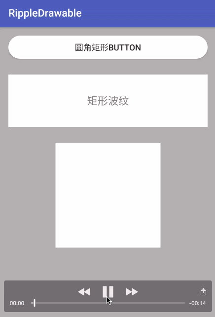

# RippleDrawable
Android控件水波纹效果，兼容&适配 api level >= 14 ROM



## How to use:
1.RippleDrawable默认提供三种波纹样式：
- 圆角矩形：
```
RippleDrawable.RippleEffect.applyRippleOfRoundRect(YOUR_VIEW，CORNOR_SIZE);
```
- 直角矩形:
```
RippleDrawable.RippleEffect.applyRippleOfRect(YOUR_VIEW);
```
- 圆形:
```
RippleDrawable.RippleEffect.applyRippleOfCircle(YOUR_VIEW, RADIUS);
```

2.提供了常用的波纹控件，避免不必要的重复代码，便于统一修改控件样式。
- RippleButton
- RippleLayout

## 需要注意的问题：
- 由于设计原理的限制，使用RippleDrawable效果的控件，不能监听onTouch事件，否则，波纹效果不生效。（当然，办法总是有的，自己动脑）
- 由于设计原理的限制，使用RippleDrawable效果的控件，重新设置背景的时候，也需要重新apply Ripple效果。否则，波纹效果会消失！

- Android 5.0及其以上，针对任何控件，都没有使用限制，Android 5.0以下，对于以下两类控件使用波纹效果，需要稍微注意：

**ImageView:** 使用scaleType = center之后,RippleDrawable效果不生效。
**ImageButton:** 使用android:scaleType="centerInside"，RippleDrawable效果才能生效。

**针对以上两种控件，建议不要直接使用RippleDrawable效果，可以在其外围包裹一层布局，对其父元素进行设置RippleDrawable效果！**
